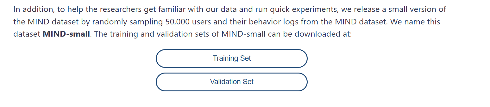
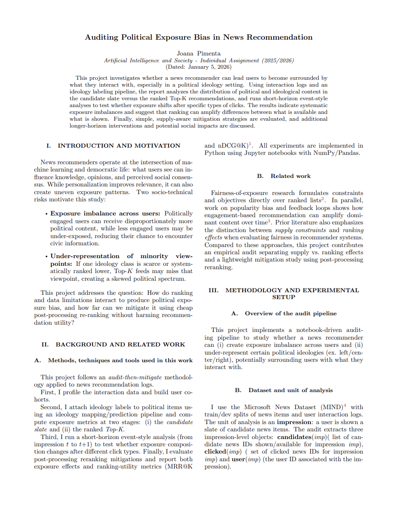

- Please run the notebooks in the correct order from 01 to 08.
- The dataset is to large to include in github so for testing please download the dataset necessary and add it in a folder called data next to the notebook folder.
- Dataset **MIND-small** is available in : https://msnews.github.io/

These are the buttons you should press to download the dataset, they will be available after you check a box agreeing to terms and conditions.

- After downloading the dataset **MIND-small**, 2 folders should be available (MINDsmall_dev and MINDsmall_train)

- Before running check if your kernel has the necessary installations for the imports used. A way to detect that, is by running the notebook and an error will pop up immediately with the command for the installations that are missing. You might need to install more things in further notebooks.

### Only the MIND-small dataset is needed so please make sure the correct dataset is used.

Note: I include audit_sample.csv in the data/processed folder since it has the manual labeling I did. In a normal scenario this file would be created and the audit would have to be redone by the user running the notebooks.

## Report

 (3).pdf)
